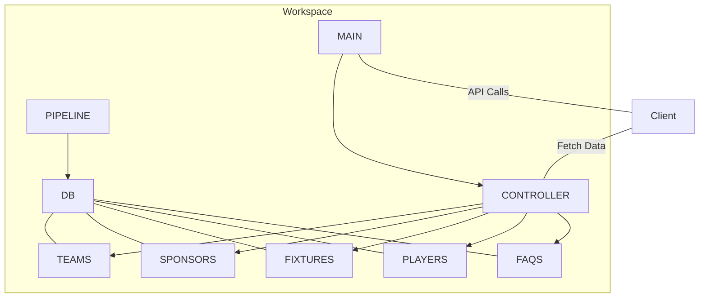

# CavsDatabase

This project provides a FastAPI backend for managing and accessing cricket-related data from the Play-Cricket API, storing it in a Turso database. It includes REST API endpoints for accessing teams, players, fixtures, results, and sponsor information.

## Project Structure

```
CavsDatabase/
├── .env.example
├── .gitignore
├── .venv/
├── main.py
├── requirements.txt
├── controllers/
│ ├── **init**.py
│ └── api_controller.py
├── database/
│ ├── **init**.py
│ └── connection.py
├── models/
│ ├── **init**.py
│ ├── faqs_list.py
│ ├── fixtures_and_results.py
│ ├── players_list.py
│ ├── sponsors_list.py
│ └── teams_list.py
└── routes/
├── competition_teams.py
├── fixtures.py
├── initdb.py
├── match_details.py
├── players.py
├── result_summary.py
└── teams.py
```

## Environment Variables

Copy `.env.example` to `.env` and configure:

```env
# Play-Cricket API Configuration
API_TOKEN=your_api_token
SITE_ID=your_site_id
LEAGUE_ID=your_league_id
COMPETITION_TYPE=your_competition_type

# Turso Database Configuration
TURSO_DATABASE_URL=your_turso_db_url
TURSO_AUTH_TOKEN=your_turso_auth_token

# Environment
NODE_ENV=development
```

## Setup

1. Clone the repository:

```bash
git clone https://github.com/Shazankk/eco-playcricket-db.git
cd CavsDatabase
```

2. Create a virtual environment and activate it:

```bash
python -m venv .venv
source .venv/bin/activate
```

3. Install the required packages:

```bash
pip install -r requirements.txt
```

4. Configure environment variables:

```bash
cp .env.example .env
# Edit .env with your configuration
```

## Available API Endpoints

Start the server:

```bash
python main.py
```

The API will be available at `http://localhost:8000` with the following endpoints:

- **GET /api/v1/teams** - Get all club teams
- **GET /api/v1/sponsors** - Get all sponsors
- **GET /api/v1/fixtures-and-results** - Get fixtures and results
- **GET /api/v1/player-stats** - Get player statistics
- **GET /api/v1/faqs** - Get frequently asked questions

## API Documentation

Once the server is running, you can access:

- Swagger UI: `http://localhost:8000/docs`
- ReDoc: `http://localhost:8000/redoc`

## Data Management Scripts

The `data_pipeline/` directory contains scripts for managing data:

- `competition_teams.py`: Manage competition teams data
- `fixtures.py`: Manage fixtures data
- `players.py`: Manage players data
- `result_summary.py`: Manage match results
- `teams.py`: Manage team data

## Basic flowchart



## Contributing

To contribute:

1. Fork the repository
2. Create a feature branch
3. Commit your changes
4. Push to the branch
5. Submit a pull request

## License

This project is licensed under the MIT License. See the `LICENSE` file for details.
